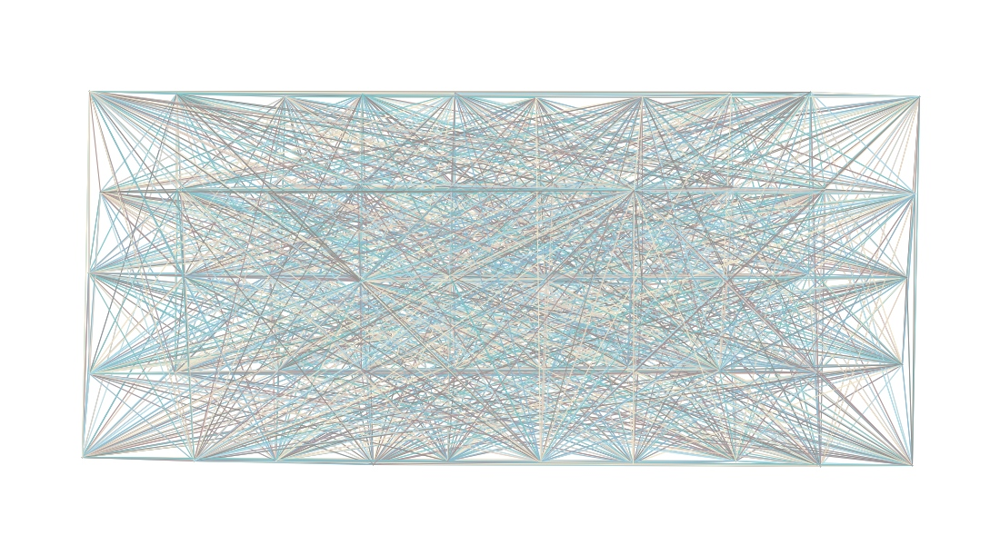
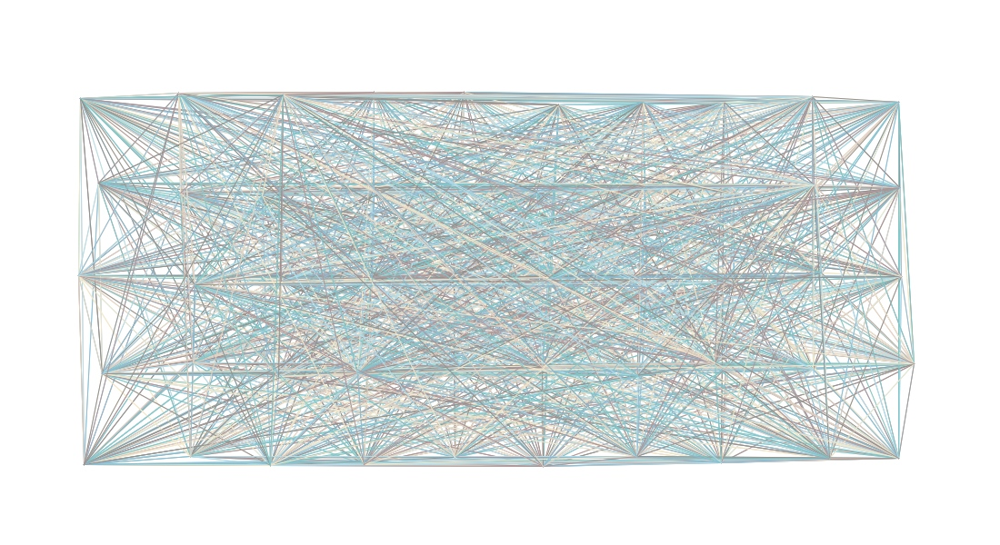
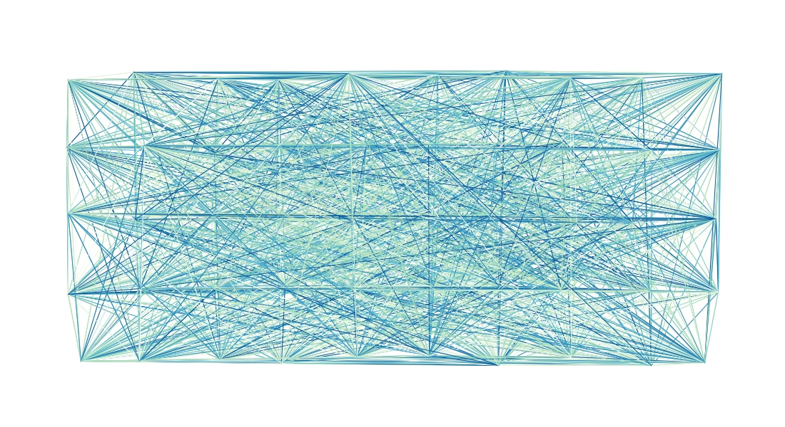
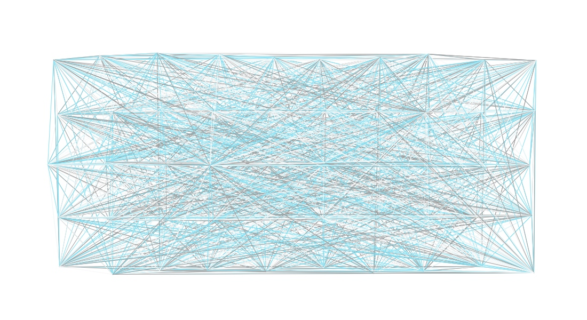
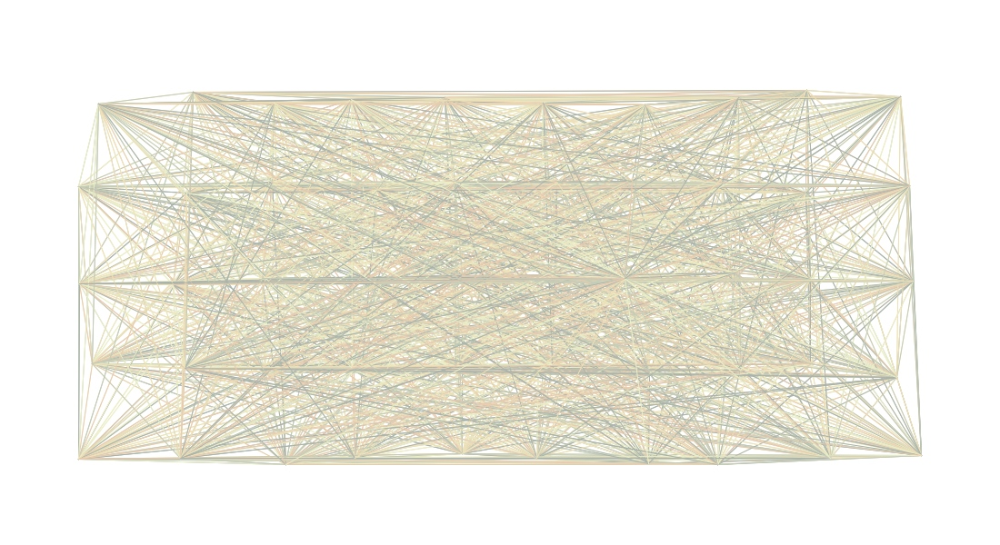

# Contribution to Genuary2022

See https://genuary.art

Technologies:

- Clojure: https://clojure.org
- clojure2d: https://github.com/Clojure2D/clojure2d

## Some generated images

## Licence

MIT Licence

## Author

Viktor Schepik
